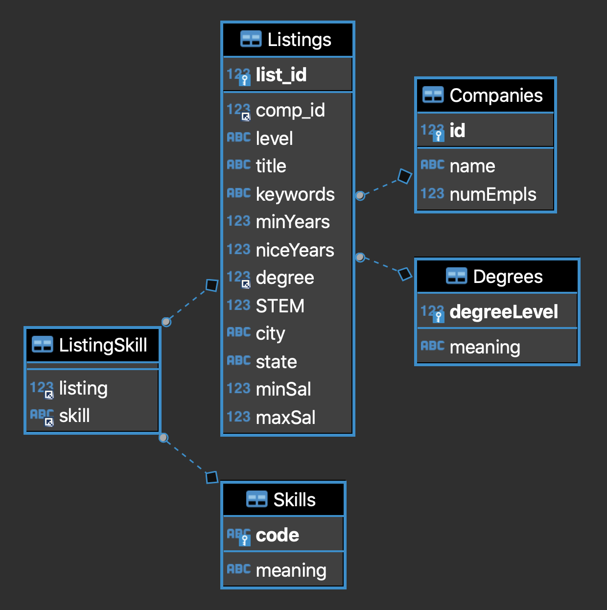

```{r setup, include=F}
knitr::opts_chunk$set(echo = T)
```


## Creating a Database on a Remote Raspberry Pi Server
|
|
We chose to use a Raspberry Pi as a server which hosts our database.  We wanted to learn how to own a bigger chunk of the process, and a Raspberry Pi, at around $70 for our fancy new 4GB RAM version with 32GB flash card, offers an attractive entry point. One benefit of opting for a database that the whole team can connect to remotely is the ability to concurrently access the data and make changes to them, without having to continually post updates to a file on, for example, GitHub.  The downside is that it's harder to walk readers through the process of recreating every step, without assigning them user access to the database.

The steps involved include the following, from the command line of the Raspberry Pi:

- Install the latest version of the MariaDB server, which is very similar to MySQL, and is the best fit for our Raspberry Pi OS (Debian10).  

- Edit the "/etc/mysql/mariadb.conf.d/50-server.cnf" file to allow the server to bind to non-local addresses.  

- Edit the "/etc/mysql/mariadb.conf.d/50-client.cnf" file's socket location to match the server one.  

- Enter MariaDB as the root user.  

Then from inside MariaDB:

- Set up each remote user with a username and password, and tell the server which IP address they will be coming from.  Grant them necessary privileges to whichever databases, and flush privileges.  

Finally:

- Make sure no firewall is blocking external traffic.  In our case, which involves a Google router, that meant creating a port forwarding rule within the Google app (taking incoming connections on a certain port and having Google relay them to the Raspberry Pi address).  


### Designing and Populating the Database  

Our data are centered on job listings from the internet, so the natural design concept to begin with is one row of a table for each listing, including whatever useful and common details we could gather from the listings as feature columns in the table. While part of our team was devising methods for scraping data from Indeed.com, we decided to make a toy database with the maximum set of features we could realistically hope to get from them, by manually scanning some LinkedIn postings for "Data Scientist" that had a salary of 120K+ and populating a "Listings" table with the features. In effect, we started with a "wide but short" table in order to get a working proof of concept that wouldn't need extra features added later.  This approach allowed us to normalize our design early on, by understanding the relationships between all future tables before we actually had the data to populate them.  

The ERD below will serve you better than any words to explain our design, but if there's one concept worth clarifying, it's that we extracted key skills mentioned in each listing (since that got to the heart of the assignment question), and used each Listing-Skill pair as a unique row in a long, narrow table. Each of the 2 columns in that table is a foreign key pointing respectively to one row in the `Listings` table and one in the `Skills` table, and the "listing" column is set to delete a row when the listing it points to is deleted (`ON DELETE CASCADE`).  

```{r out.width="100%", echo=FALSE}

#knitr::include_url("https://gyazo.com/053e92f273fbaa66876c7a7820de296a")
#knitr::include_url("https://github.com/zachsfr/Data-607-Project-Three/blob/Ethan-Branch/PROJ3_ERD.png")
```
                       


The code for making tables from multiple sources is perhaps more tangled than interesting, and is not executable at any rate, without a connection to the database, but is included in a separate file, [TableMaker.Rmd]('TableMaker.Rmd') 

Next Steps for this part of the project might include fully normalizing the `Listings` table such that  

- job levels are in a table similar to `Degrees`, and represented ordinally by an integer in likewise fashion, and  

- (city, state) combinations are represented instead by an integer which points to a row containing that tuple in a `Location` table.  

---------------------------------------------


