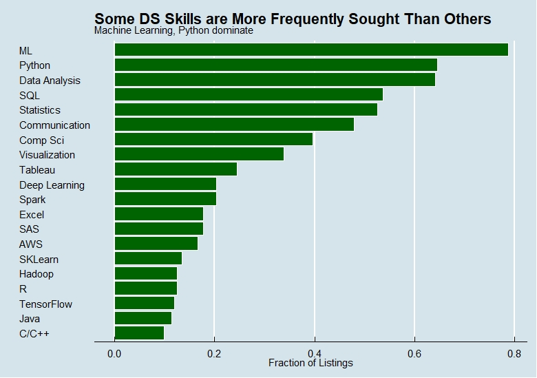
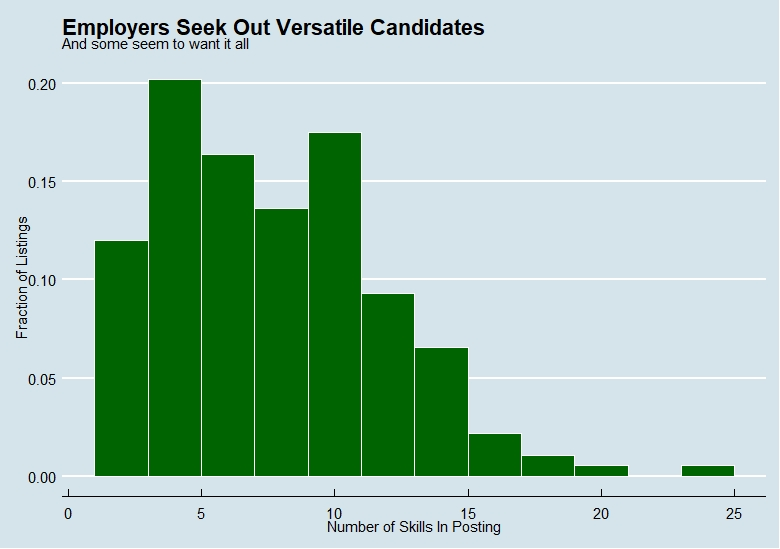
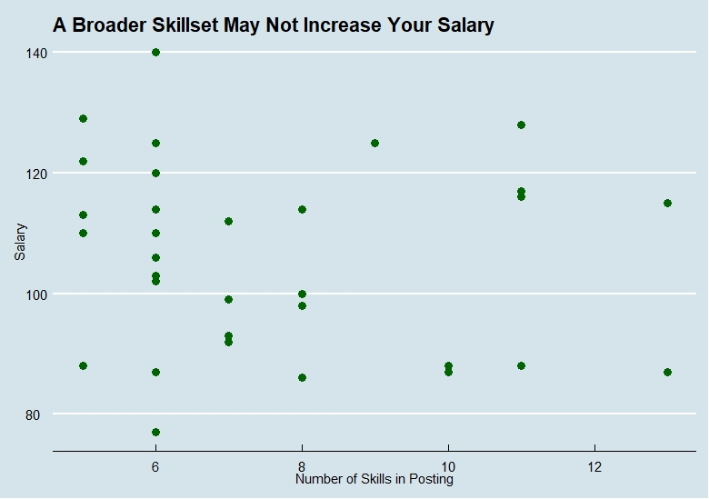
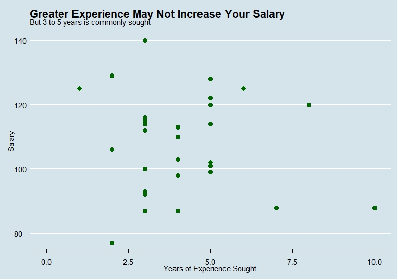

```{r setup, include=FALSE}
knitr::opts_chunk$set(echo = T,warning = F,message = F)
```

## Introduction
|   In this project, our objective was to identify & refine skills (e.g., workflows, communications, behaviors) that help scaffold successful team collaborations in a virtual work environment. Our secondary goal was to apply these skills as part of a distributed team tasked with identifying the most valued data science skills in today's job market.
|
|   Our project team (Zachary Safir, Ethan Haley, Daniel Moscoe, and Sean Connin) accomplished these goals by co-developing a data "pipeline" for current data science job listings on the search service, Indeed (www.indeed.com).

The key steps involved in this process included:

1. Developing code (R/Python) to scrape job listings information from an Indeed search query;
2. Cleaning and wrangling the data into tidy form;
3. Employing text analysis methods to create metrics for skill value from the job listings;
4. Constructing a relational database of normalized tables to query and analyze this information, using a remote server to facilitate access;
5. Co-authoring this final project report.

### Methods
|   Our methodology involved various components. Key among them were team meetings via video conference. We met three times over two weeks to ensure agreement on project goals, development, and results. Regular asynchronous exchanges via Slack also enabled us to provide each other assistance and updates during interim periods. 
|
|   We used the the RStudio work environment to mine, clean and visualize our data, and we used a shared Github repository to host our individual contributions. The repository can be accessed on Github [here](https://github.com/zachsfr/Data-607-Project-Three/tree/main).
|   To support our analyses, the wrangled data was stored in a MYSQL database hosted on a Raspberry Pi 4 (MariaDB server version 10.3.27). We did explore other hosting options for our database (e.g., AWS) but opted for the Raspberry Pi to facilitate greater administrative control. This choice also allowed us to work through the process of hand-crafting a server. 
|
|   This report is organized into sections outlining each of the key project steps. Each section includes an overview, relevant script, and related discussion. 
|
|   Our project assessment (observations, lessons learned, etc.) is included in the Conclusion section.
|

```{r, echo=FALSE}
library(rvest)
library(tidyverse)
library(xml2)
library(stringr)
library(rjson)
library(reticulate)
library(DBI)
library(magrittr)
library(tm)
library(DT)
library(readxl)
```


## Data Collection: Webscraping Indeed Job Listings

|   In this section we outline and describe steps to acquire and transform job listing information from an Indeed job search query. In this latter context, we limited our search to the Atlanta, Georgia metro area - a regional hub for data intensive technology companies.
|
|   Job listing data and descriptions were scraped from Indeed search results using the R package, rvest. A single search query afforded us two levels of information. The first included basic listing entries (returned over a sequence of pages). The second returned full job descriptions (from secondary pages linked to each listing).
|
|   The raw data (basic summary variables and full job descriptions) was compiled into an R dataframe to facilitate subsequent cleaning and formatting. It's worth noting that the job descriptions were saved as individual text files without modification. In contrast, basic summary variables from each listing were cleaned and wrangled into tidy form before saving in a single csv file. This file can be identified on our Github repository as Atlanta_Clean.csv. 
|
|   The following code accomplishes the steps listed above. However, modifications related to Indeed URLs will be required to account for real-time changes in the job listings. 
|   First, we start with code to scrape the web-pages and compile the raw data into a dataframe.
|

```{r,eval=F}
#Create dataframe to capture all listings associated with search as well as select parameters
listings <- data.frame(matrix(ncol=5))
colnames(listings) = c("Company", "Job_Title", "Location", "Links", "Job_Description") 
#loop through pages of listings for single search
for (i in seq(10,100,10)){
    
    #first line is the landing page after search query
    
    url_start <- "https://www.indeed.com/jobs?q=data+scientist&l=Atlanta%2C+GA"
    
    # provides url for subsequent pages
    
    url <- paste0(url_start, "&start=", i)
    
    # reads all info on each page
    
    target <- xml2::read_html(url)
    
    #Sys.sleep(2)
    
    # Company names on each page
    
    Company <- target %>% 
        rvest::html_nodes(".company") %>%
        rvest::html_text() %>%
        stringi::stri_trim_both()
    
    # Job Titles on each page
    
    Job_Title <- target %>% 
        rvest::html_nodes("div") %>%
        rvest::html_nodes(xpath = '//*[@data-tn-element = "jobTitle"]') %>%
        rvest::html_attr("title")
    
    # Job Locations on each page
    
    Location<- target %>% 
        rvest::html_nodes(".location") %>%
        rvest::html_text()
    
    # Job Links on each page --> these should link to individual job pages
    
    Links <- target %>% 
        rvest::html_nodes('[data-tn-element="jobTitle"]') %>%
        rvest::html_attr("href")
    
    # Collect job descriptions from linked pages
    
    Job_Description <- c()
    
    for(i in seq_along(Links)) {
        
        p_url <- paste0("https://www.indeed.com", Links[i])
        pg <- xml2::read_html(p_url)
        
        description <- pg %>%
            rvest::html_nodes("span")  %>% 
            rvest::html_nodes(xpath = '//*[@class="jobsearch-JobComponent-description icl-u-xs-mt--md"]') %>% 
            rvest::html_text() %>%
            stringi::stri_trim_both()
        
        Job_Description <- c(Job_Description, description)
    }
    
    df <-data.frame(Job_Title, Company, Location, Links, Job_Description)
    
    listings <- rbind(listings, df) # build final dataframe
}

```


### Creating Text Files and CSV for Analysis 
|   Second, we create text files that save our listing job descriptions, and we create a separate .csv file that contains basic variable data for each listing.
|
```{r,eval=F}
listings <- listings %>% mutate(ID = row_number()) # add row number
# write individual descriptions to text files using row number
for (i in 1:nrow(listings)) {
      write(listings$Job_Description[i], paste0(listings$ID[i], ".txt")) 
 }
# export remainder of dataframe to csv
Atlanta<-listings%>%select(Job_Title, Company, Location, Links)
write.csv(Atlanta, file = "Atlanta_Table.csv")
```


### Cleaning the Data
|   Finally, we clean and wrangle our variables and save them in tidy form as a completed .csv file.
|
```{r}
Atl <- read_csv("https://raw.githubusercontent.com/zachsfr/Data-607-Project-Three/Sean-Branch/Atlanta_Table.csv",trim_ws =T)

Atl <- Atl %>%
    filter(!X1 ==1 ) %>%
    select(!X1) %>%
    rowid_to_column("ID") %>%
    mutate( across(.cols = everything(),~str_squish(.)))  


Atl <- Atl %>%
    separate(Location, c("City", "State"), ",") %>%
    separate(State, c("tmp", "State", "Zip_Code"), "\\s") %>%
    select(-c( tmp, Links))

# Create categories of job_level
Atl <- Atl%>%
  mutate(Job_Level = case_when(grepl("Intern", Job_Title) ~ "Intern",
    grepl("^Data Analyst|Entry Level", Job_Title, ignore.case=TRUE) ~ "Junior",
    grepl("Senior Data Scientist|Director|Lead|Principal|Sr.|President", Job_Title, ignore.case=TRUE)~"Senior",
    grepl("^Associate.+|Senior Data Analyst|Data Engineer|Senior Associate|Machine Learning|ML|AI|Data Engineer|Manage.+|Data Scientist|Specialist|Data Science", Job_Title, ignore.case=TRUE)~"Mid_Level"))%>%
    relocate(Job_Level, .after=Job_Title)

```

|

```{r,echo=F}
datatable(Atl)
```

|

```{r,eval=F}
    
write.csv(Atl, file = "Atlanta_Clean.csv")
```

## Alternate Scraping Method, Using Python inside R
|   We elected to collect job listings data via web-scraping rather than an API owing to restrictions on user access applied by Indeed as well as other organizations. We did weigh the ethics of collecting data in this fashion but determined that our approach was justified on several points: a) this was an educational project, and b) the scope of our data collection process was limited. 
|
|   Nonetheless, web-scraping has its limitations. For example, job search queries such as ours often return pages that incorporate multiple encodings - which can prevent scripts from successfully translating this information. In addition, organizations are deploying safeguards in increasing number (e.g., Captcha) to prevent or decrease queries originating from the same IP address.
|
|   The Python package "Beautiful Soup" is well-designed for modern web-scraping strategies and workflows. We have included a Python script below for demonstrative purposes within the Rstudio work environment. The code used below is adapted from [here](https://github.com/israel-dryer/Indeed-Job-Scraper) with some modifications of our own.

### Importing Python Modules
| As shown below, as we would before starting on our R work, we import the Python libraries we will use in the following sections.
|

```{python,eval=F}
from bs4 import BeautifulSoup
import requests
import numpy as np
import csv
import pandas as pd
from time import sleep
from random import randint
from datetime import datetime
import re
```


### Creating Python Functions
|   We can take advantage of Python's structure to break up different tasks into separate methods. In the R code where we used rvest above, we threw all our code into one long for loop. We could have created a function around it, but there is no simple way to build on what we did without running into issues with that type of approach.
|
|   Our very first method that we create allows for our code to be easily reused for different jobs and locations. The get_url function takes in two strings, a job position and location name, and returns a usable url to get the resulting indeed search for those terms. 
|

```{python}

def get_url(position,location):
    template = "https://www.indeed.com/jobs?q={}&l={}"
    url = template.format(position,location)
    return url
```

|
|   As shown below, we can even access the Python methods we created inside our R code. We simple use the command py$ and we can access any function, value, and so on that we create in Python. 
|
```{r,eval=F}
py$get_url("Test","Test")
```

|

```{r, echo=FALSE}
knitr::include_graphics('https://i.gyazo.com/c7957937e329f9ed1665a74f9ca56a1c.png')
```


|
|   The get_record method is used to get the relevant pieces of information for each job listing on Indeed's website. Similar to our above approach, we look through the html tags and find the key names for each piece of information we want to find. With Python, we don't need as much code to accomplish this, and can control what happens if a listing is missing information. 
|
```{python,eval=F}
def get_record(card):
    atag = card.h2.a
    try:
        job_title = atag.get('title')
    except AttributeError:
        job_title = ''
    try:
        company = card.find('span', 'company').text.strip()
    except AttributeError:
        company = ''
    try:
        location = card.find('div', 'recJobLoc').get('data-rc-loc')
    except AttributeError:
        location = ''
    try:
        job_summary = card.find('div', 'summary').text.strip()
    except AttributeError:
        job_summary = ''
    try:
        post_date = card.find('span', 'date').text.strip()
    except AttributeError:
        post_date = ''
    try:
        salary = card.find('span', 'salarytext').text.strip()
    except AttributeError:
        salary = ''
    
    extract_date = datetime.today().strftime('%Y-%m-%d')
    
    job_url = 'https://www.indeed.com' + atag.get('href')
    
    return (job_title, company, location, job_summary, salary, post_date, extract_date, job_url)

```

|
|   Another key feature we can use in our Python approach is a header. The code below creates a header that will be sent with each request to get information from an Indeed web page. Using a header, our request will be less likely to be blocked by a Captcha. 
|

```{python,eval=F}
headers = {
    'accept': 'text/html,application/xhtml+xml,application/xml;q=0.9,image/webp,image/apng,*/*;q=0.8,application/signed-exchange;v=b3;q=0.9',
    'accept-language': 'en-US,en;q=0.9',
    'cache-control': 'max-age=0',
    'sec-fetch-dest': 'document',
    'sec-fetch-mode': 'navigate',
    'sec-fetch-site': 'none',
    'sec-fetch-user': '?1',
    'upgrade-insecure-requests': '1',
    'user-agent': 'Mozilla/5.0 (Windows NT 10.0; Win64; x64) AppleWebKit/537.36 (KHTML, like Gecko) Chrome/87.0.4280.67 Safari/537.36 Edg/87.0.664.47'
}

```

|
|   The final method shown below pulls all our other methods together. Using a supplied position and location, it will continue grabbing all the job information from Indeed until there are no longer any pages left for it read.
|
|   The code accomplishes this in an extremely efficient way. On Indeed's website, each job listing has its own dedicated div card. By making a list of only those cards, we can consistently loop through and find our desired information.
|
|   Unfortunately, each Indeed page only has an initial summary of each job. In order to see the full job description, you either need to actively click on the listing from their webpage, or load the separate URL for that specific job listing in order to see the full information for each job. To remedy this, we could pull both the URL for each job listing and the resulting html for each of those pages as we do below. However, in order to further avoid Indeed from blocking us with a captcha, we used a randomized delay below. Therefore, it would take a large amount of time more for us to pull all the extra information that we want. So, for this demonstration we will stick with the original code and grab only the summary for each job. 
|
|   Another interesting topic to discuss is how our code is able to determine if there are no further web pages to scrape. There is no clear indication in either the URL or on each web page as to whether we have reached the end or not. However, upon further inspection of the html itself, we discover that on pages that have a next button available, we can find an <a> tag that represents a next button existing or not. Using this, we can take advantage of how the Python while loop works to continue pulling pages until that <a> tag no longer exists. 
|
|   Finally, once the code has reached the very last page for our search result, we can then use pandas to transform our list full of job information into a dataframe.
|

```{python,eval=F}
def get_data(position,location):

    records = [] 
    url = get_url(position, location)  
  
    while True:
        response = requests.get(url,headers=headers)
        soup = BeautifulSoup(response.text, 'html.parser')
        cards = soup.find_all('div', 'jobsearch-SerpJobCard')  
        for card in cards:
            record = get_record(card)
            records.append(record)
  
        try:
            url = 'https://www.indeed.com' + soup.find('a', {'aria-label': 'Next'}).get('href')
            delay = randint(1, 50)
            sleep(delay)
        except AttributeError:
  
            break
    return pd.DataFrame(records)


```

### Calling our Python Functions in R and the Final Data
|   We can then choose to create an R function that acts as the constructor, calling the functions we created using R code. The resulting dataframe created through all this can be viewed below.
|

```{r,eval=F}
indeed_scraper <- function(position,location){
  
  x <- py$get_data(position,location)
  x
}


```

|

```{r eval=FALSE}
NY <- indeed_scraper("Data Science","NY")
```

|

```{r,eval=F}
    
write.csv(NY, file = "Data-Science-Nyn.csv")
```

|

```{r,echo=F}
NY <- read_csv("https://raw.githubusercontent.com/zachsfr/Data-607-Project-Three/Zach-Branch/Data-Science-Ny.csv")
datatable(NY)
```


## Analyzing The Text Data from rvest
|   Most of the information in the job listings we scraped from Atlanta resides in narrative descriptions. In order to programmatically analyze the contents of these descriptions, we create a document-term matrix.
|
|   A document-term matrix is a dataset measuring the number of occurrences of each distinct word in a corpus of text. Each distinct word in the corpus is represented by a column, and each document in the corpus occupies a row. Entries in the matrix give the number of occurrences of a particular word in a particular document.
|

```{r}
if(!file.exists('Data-607-Project-Three-Dan-Branch')) {
    download.file(
"https://github.com/zachsfr/Data-607-Project-Three/archive/refs/heads/Dan-Branch.zip", 
                  destfile = 'Dan-Branch.zip',mode = "wb")
      unzip("Dan-Branch.zip")
  
  }


atlanta  <- ("Data-607-Project-Three-Dan-Branch/atlanta")
```

|
|   Before constructing the matrix, we transform the text in the corpus. These transformations help us avoid generating columns for unimportant words (the so-called "stopwords"). Converting all the text to lowercase consolidates words that differ only by capitalization.
|
```{r}
atlanta_corpus <- VCorpus(DirSource(atlanta, encoding = "UTF-8"), readerControl = list(language = "en"))
```

|
|   Some of the terms we're interested in are not single words containing only letters. For example, "C++" contains punctuation, "machine learning" is a two-word phrase, and "R" appears within many words unrelated to the statistical software. To capture these terms in our document-term matrix, we search for them and replace them with strings containing only letters. In some cases, the search strings are regular expressions.
|
```{r}
find <- c("artificial intelligence","amazon web services","[^[[:alnum:]][Cc]\\#","[^[[:alnum:]][Cc]\\+\\+","computer science","computer vision","data analysis","data engineering","data wrangling","deep learning","large datasets","machine learning","natural language processing","neural networks","object oriented","project management","[^[[:alnum:]][Rr][^[[:alnum:]]","scikit-learn","software development","software engineering","time series")
repl <- c("ai","aws"," csharp"," cplusplus","computerscience","computervision","dataanalysis","dataengineering","datawrangling","deeplearning","largedatasets","machinelearning","nlp","neuralnetworks","oop","projectmanagement"," rrrr","scikitlearn","softwaredevelopment","softwareengineering","timeseries")
for (i in seq(length(find))) {
  atlanta_corpus <- tm_map(atlanta_corpus, content_transformer(function(atlanta_corpus) gsub(atlanta_corpus, pattern = find[i], replacement = repl[i])))
}
```

|
|   With these special terms of interest transformed, we can perform the final transformation on the corpus, removing punctuation.
|

```{r}
atlanta_corpus <- tm_map(atlanta_corpus, removePunctuation)
```

|
|   We use the `tm` package to generate the document-term matrix, and then transform it to a dataframe.
|

```{r}
document_term <- DocumentTermMatrix(atlanta_corpus)
document_term <- document_term %>%
  as.matrix() %>%
  as.data.frame()
```

|
|   The purpose of the document-term matrix is to identify occurrences of data science skills in our corpus of job descriptions. With this purpose in mind, we drop columns that do not identify data science skills. The column names we want to keep are listed in `ds_skills_list`, and the dataframe containing only these columns of interest is `ds_skills_df`.
|

```{r}
ds_skills_list <- c("ai","airflow","analysis","aws","azure","bigquery","c","caffe","caffe2","cassandra","communication","computerscience","computervision","cplusplus","csharp","d3","dataanalysis","dataengineering","datawrangling","databases","deeplearning","docker","excel","fintech","git","hadoop","hbase","hive","java","javascript","keras","kubernetes","largedatasets","linux","machinelearning","mathematics","matlab","mongodb","mysql","neuralnetworks","nlp","nosql","numpy","oop","pandas","perl","pig","projectmanagement","publications","python","pytorch","rrrr","sas","scala","scikitlearn","scipy","sklearn","softwaredevelopment","softwareengineering","spark","spss","sql","statistics","tableau","tensorflow","theano","timeseries","unix","visualization")
ds_skills_in_document_term <- cbind(ds_skills_list, ds_skills_list %in% colnames(document_term))
ds_skills_in_document_term <- as.data.frame(ds_skills_in_document_term)
ds_skills_in_document_term <- ds_skills_in_document_term %>%
  filter(V2 == "TRUE")
ds_skills_df <- document_term %>%
  select(ds_skills_in_document_term$ds_skills_list)
```

|
|   Finally, we perform some tidying on `ds_skills_df`.
|

```{r}
ds_skills_df <- rownames_to_column(ds_skills_df)
ds_skills_df <- rename(ds_skills_df, "listing" = "rowname", "r" = "rrrr")
ds_skills_df <- ds_skills_df %>%
  mutate("listing" = substr(listing,0,nchar(listing)-4))
```


## Creating a Database on a Remote Raspberry Pi Server
|   We chose to use a Raspberry Pi as a server which hosts our database.  We wanted to learn how to own a bigger chunk of the process, and a Raspberry Pi, at around $70 for our fancy new 4GB RAM version with 32GB flash card, offers an attractive entry point. One benefit of opting for a database that the whole team can connect to remotely is the ability to concurrently access the data and make changes to them, without having to continually post updates to a file on, for example, GitHub.  The downside is that it's harder to walk readers through the process of recreating every step, without assigning them user access to the database.
|
|   The steps involved include the following, from the command line of the Raspberry Pi:
- Install the latest version of the MariaDB server, which is very similar to MySQL, and is the best fit for our Raspberry Pi OS (Debian10).  

- Edit the "/etc/mysql/mariadb.conf.d/50-server.cnf" file to allow the server to bind to non-local addresses.  

- Edit the "/etc/mysql/mariadb.conf.d/50-client.cnf" file's socket location to match the server one.  

- Enter MariaDB as the root user.  

|   Then from inside MariaDB:
- Set up each remote user with a username and password, and tell the server which IP address they will be coming from.  Grant them necessary privileges to whichever databases, and flush privileges.  

|   Finally:

- Make sure no firewall is blocking external traffic.  In our case, which involves a Google router, that meant creating a port forwarding rule within the Google app (taking incoming connections on a certain port and having Google relay them to the Raspberry Pi address).  


### Designing and Populating the Database  

|   Our data are centered on job listings from the internet, so the natural design concept to begin with is one row of a table for each listing, including whatever useful and common details we could gather from the listings as feature columns in the table. While part of our team was devising methods for scraping data from Indeed.com, we decided to make a toy database with the maximum set of features we could realistically hope to get from them, by manually scanning some LinkedIn postings for "Data Scientist" that had a salary of 120K+ and populating a "Listings" table with the features. In effect, we started with a "wide but short" table in order to get a working proof of concept that wouldn't need extra features added later.  This approach allowed us to normalize our design early on, by understanding the relationships between all future tables before we actually had the data to populate them.  
|
|   The ERD below will serve you better than any words to explain our design, but if there's one concept worth clarifying, it's that we extracted key skills mentioned in each listing (since that got to the heart of the assignment question), and used each Listing-Skill pair as a unique row in a long, narrow table. Each of the 2 columns in that table is a foreign key pointing respectively to one row in the `Listings` table and one in the `Skills` table, and the "listing" column is set to delete a row when the listing it points to is deleted (`ON DELETE CASCADE`).  
|
|

```{r out.width="100%", echo=FALSE}
knitr::include_graphics('https://i.gyazo.com/053e92f273fbaa66876c7a7820de296a.png')
```

|                       
|   The code for making tables from multiple sources is perhaps more tangled than interesting, and is not executable at any rate, without a connection to the database, but is included in a separate file, [TableMaker.Rmd](https://github.com/zachsfr/Data-607-Project-Three/blob/Ethan-Branch/TableMaker.Rmd) 
|
|   Next Steps for this part of the project might include fully normalizing the `Listings` table such that  

- job levels are in a table similar to `Degrees`, and represented ordinally by an integer in likewise fashion, and  

- (city, state) combinations are represented instead by an integer which points to a row containing that tuple in a `Location` table.

## Visualising our Data
|   In this final section, we will display some visualizations that were created using our data. The code used to create these visuals can be found [here](https://github.com/zachsfr/Data-607-Project-Three/blob/Dan-Branch/visualizations.R#L7).

|
|   What data science skills are most valuable on the job market? Because only a small subset of our sample includes salary information, it is not possible to for us to estimate the monetary value of specific skills. However, we can make several important claims about the state of the data science job market. These claims are provisional, because our sample is small and not representative of the population of data science job listings in the United States. However, it seems reasonable to us that similar results would be found in a larger representative sample.
|
|   Some data science skills are more frequently sought than others. The most frequently-sought skills include expertise in machine learning, Python, data analysis, and SQL. The only soft skill to make the top twenty is communication. While R is included in the top twenty most frequently sought skills, there is a large gap between the fraction of listings in which it appears compared to Python. 
|
|

```{r, echo=FALSE}

```

|
|
|   Employers seek out versatile candidates. Most employers seek out candidates with experience in 5 to 10 of the skills we analyzed. The number of skills listed in postings is skewed right, which shows that some employers are asking for a very broad skillset from candidates. Further analysis is required to understand the difference in job responsibilities between a listing requesting five or fewer specific skills, versus one seeking ten or more. Perhaps employers listing many skills are doing so to ensure their listings appear as results for as many data science job search queries as possible.
|
|
```{r, echo=FALSE}

```

|
|
|   A broader skill set may not increase a candidates salary. While we obtained salary information for only a small subset of our sample, there was no apparent relationship between the number of skills appearing in a posting and the listed salary. This suggests that employers expect a trade off between depth and breadth of skill in candidates. That is, candidates with expertise in fewer skills are expected to possess deeper knowledge, while candidates with experience in a greater range of skills may be placed in more generalist roles.
|
|

```{r, echo=FALSE}

```

|
|
|   Greater experience may not increase a candidates salary, but 3-5 years is commonly sought. Among our sample, there was a reluctance among employers to seek out candidates new to the field. Employers also seem not to advertise specifically for candidates with a decade or more of experience. Regardless of a candidates experience, we found no relationship between experience and salary in our small sample.
|
|

```{r, echo=FALSE}

```


## Conclusion 
|   Throughout this project, each and every one of us took up the challenge to go above and beyond in order to learn new skills. We were by no means required, or even expected, to use web scraping in order to gather our data. Despite that, we ventured to figure out how to do so on our own initiative. 
|
|   We then sought to discover how we could transform the overwhelming amount of text data that we acquired into usable information. Using the tm library, we were able to take those job descriptions and reshape that mess of information into concise variables that could be used for analysis. 
|
|   Then, in order to get acquainted with a device that is key in developing important skills in our field, we chose to use a Raspberry Pi to create our database. It was no simple matter getting it work the way we desired. However, through the struggle, we become more familiar with the command line, different networking terminology, and various other tools that will very likely become useful to us in the future. 
|
|   Finally, using the cleaned up data, we were able to create visualizations that illuminate interesting aspects about the various job listings for Data Scientists. 
|
|   Throughout this project, our objective has been to discover the most valuable skills for data scientists. We of course managed to answer that  in a literal sense with our visualizations. However, ultimately through working on this project together, we found that the skill that led us the farthest was our desire to learn and challenge ourselves to grow as individuals. This proved to be the most important driving force behind each and every one of us. It is also the very reason that we are all now working on this project together. Our desire to pursue further education has all led us here to this point. Hopefully, through reading our project, you will also feel inspired to learn something new as well. Thank you very much.